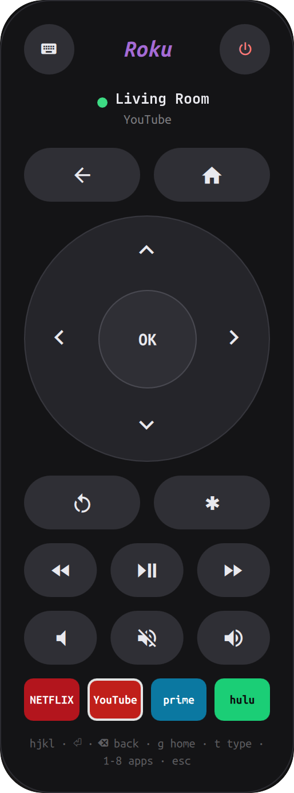

# Roku Remote for Omarchy

<p align="center"></p>

A Roku remote that looks like a real one, as a floating window for [Omarchy](https://omarchy.org)
(Hyprland + Quickshell). Keyboard- and mouse-driven, talks straight to your TV over your local network.

- Round buttons, a circular D-pad with OK, media and volume rows
- Four coloured app buttons (keys `1`-`4`; `5`-`8` also work) and a "now playing" line
- Type into the TV's on-screen keyboard from your keyboard
- Switch between several Rokus (Tab, or click the TV name)
- Bundled `roku` command-line tool (`roku home`, `roku volup*3`, `roku netflix`, ...)

## Requirements

- Omarchy with the shell plugin system (`omarchy-shell`), Hyprland, `python3`
  (developed and tested on Hyprland 0.56 with a TCL Roku TV running Roku OS 15; other models should work but are untested)
- A Roku on the same network, with **Settings > System > Advanced system settings > Control by
  mobile apps > Network access** set to **Permissive** (the default "Limited" mode ignores button presses;
  the remote shows a banner if it detects this)

## Install

```bash
omarchy plugin add <git-url-of-this-repo> --enable --yes
```

(or clone this repo into `~/.config/omarchy/plugins/charles.roku-remote/`, then
`omarchy-shell shell rescanPlugins` and `omarchy plugin enable charles.roku-remote`).

Then add the window rule and keybind from [`extras/hyprland.lua`](extras/hyprland.lua) to your Hyprland
config and run `hyprctl reload`. The window rule is what makes the remote a small floating window on the
right edge; without it the remote will tile like a normal window.

Optional, for the terminal command and TV-volume keybinds:

```bash
./install.sh     # links bin/roku to ~/.local/bin/roku
roku list        # finds Rokus on your network
roku default <name>
```

If you have several Rokus, pick yours with `roku default <name>`. The remote uses that default (Tab switches TVs
while it's open); with no default set it starts on the first Roku it finds.

The first time it opens, the remote scans your local /24 network for Rokus, which takes a few seconds; the result is
cached in `~/.cache/roku.json`. Run `roku list` any time to rescan.

## Keys

| Key | Action | Key | Action |
|---|---|---|---|
| `h j k l` / arrows | D-pad | `Enter` | OK |
| `Backspace` / `b` | Back | `g` / `Home` | Home |
| `Space` | Play / pause | `,` `.` | Rewind / forward |
| `r` | Instant replay | `i` / `*` | Options |
| `+` `-` | Volume | `m` | Mute |
| `p` | Power | `t` or `/` | Type text (Esc stops) |
| `1`-`8` | Launch app | `Tab` | Switch TV |
| `Esc` | Close | | |

## Command line

```
roku list                     find Rokus (cached in ~/.cache/roku.json)
roku [-d NAME] KEY...         home up down left right select back play rev fwd volup voldown mute power ...
roku [-d NAME] type "text"    type into an on-screen keyboard
roku [-d NAME] apps           list installed apps
roku [-d NAME] launch APP     launch an app (`roku netflix` works too)
roku [-d NAME] status         power state / active app
roku default NAME             remember the default TV
```

Repeat a key with `KEY*N`, e.g. `roku down*5 select`. `NAME` is part of a device name or an IP address.

## How it works

The remote uses Roku's local External Control Protocol (HTTP on port 8060) - no cloud, no account. Discovery
scans your local subnet for Rokus. Colours are fixed (the Roku look), not taken from your Omarchy theme.

## Troubleshooting

- **"Limited mode" banner / `403 Forbidden`:** set Network access to Permissive on the TV (see above).
- **"Can't reach this Roku":** the TV is off or on another network/VLAN.
- **Nothing found:** run `roku list` in a terminal to rescan.
- **After editing `Remote.qml`:** run `omarchy restart shell` (plugin QML is cached).

## License

MIT - see [LICENSE](LICENSE).
